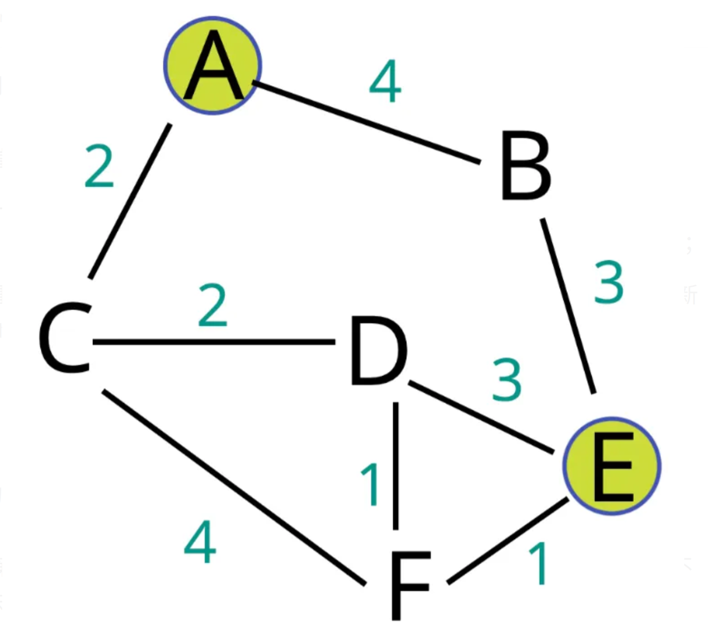

# Bellman Ford
1. 和Dijkstra相同，用於解決單源到其他點的最短距離
2. 和Dijkstra不同，可以有negative edge
3. 可以判斷是否有negative cycle，但處理，因為有negative cycle不會存在最短距離
4. Dijkstra是對目前未處理且weight最小的邊進行處理，Bellman Ford是在每一次對所有邊進行處理，進行V-1次
5. 因為會把每次的最短路徑紀錄起來，是DP的一種
6. 時間複雜度比Dijkstra高，O(VE)

## Example


Start from node A, and the dst is E find the shortest path

1. Initial the distance start from A
   dist = [0, inf, inf, inf, inf, inf]

2. Update the dist
   dist = [0, 4, inf, inf, inf, inf]
   dist = [0, 4, 2, inf, inf, inf]
   dist = [0, 4, 2, inf, inf, inf]
   dist = [0, 4, 2, inf, 7, inf]
   $\vdots$
   dist = [0, 4, 2, 4, 6, 5]

## Implement
### C++
```cpp=
#include <bits/stdc++.h>

using namespace std;

class bellman_ford
{
	private:
		int n;
		bool neg_cycle;
		vector<vector<pair<int, int>>> graph;
		vector<vector<int>> dist;
		vector<bool> calculated;
	public:
		bellman_ford(vector<vector<pair<int, int>>> &g)
		{
			graph = g;
			n = g.size();
			neg_cycle = false;
			dist.resize(n, vector<int>(n, INT_MAX));
			for(int i = 0; i < n; i++)
				dist[i][i] = 0;

			calculated.resize(n, false);
		}

		int find_shortest(int src, int dst)
		{
			if(neg_cycle)
			{
				cout << "There is negative cycle!" << endl;
				return -1;
			}

			if(calculated[src])
				return dist[src][dst];

			calculated[src] = true;

			//do n-1 times
			for(int i = 1; i < n; i++)
			{
				for(int j = 0; j < n; j++)
				{
					for(pair<int, int> g : graph[j])
					{
						int v = g.first;
						int w = g.second;
						if(dist[src][v] > dist[src][j] + w && dist[src][j] != INT_MAX)
							dist[src][v] = dist[src][j] + w;
					}
				}
			}

			for(int i = 0; i < n; i++)
			{
				for(pair<int, int> g : graph[i])
				{
					int v = g.first;
					int w = g.second;
					if(dist[src][v] > dist[src][i] + w && dist[src][i] != INT_MAX)
					{
						cout << "There is negative cycle!" << endl;
						neg_cycle = true;
						return -1;
					}
				}
			}

			return dist[src][dst];
		}
};
```

## Python
```python=
class bellman_ford:
    def __init__(self, graph):
        self.n = len(graph)
        self.neg_cycle = False
        self.graph = graph
        self.dist = [[float("inf") for i in range(self.n)] for j in range(self.n)]
        self.check = [False for i in range(self.n)]

        for i in range(self.n):
            self.dist[i][i] = 0

    def find_shortest(self, src, dst):
        if self.neg_cycle:
            print("There is negative cycle")
            return -1

        if self.check[src]:
            return self.dist[src][dst]

        for i in range(1, self.n):
            for j in range(self.n):
                for e in self.graph[j]:
                    v, w = e[0], e[1]
                    if self.dist[src][v] > self.dist[src][j] + w and self.dist[src][j] != float("inf"):
                        self.dist[src][v] = self.dist[src][j] + w;

        for i in range(self.n):
            for e in self.graph[i]:
                v, w = e[0], e[1]
                if self.dist[src][v] > self.dist[src][i] + w and self.dist[src][i] != float("inf"):
                    print("There is negative cycle")
                    return -1

        return self.dist[src][dst]
```

###### `Graph` `DP`
