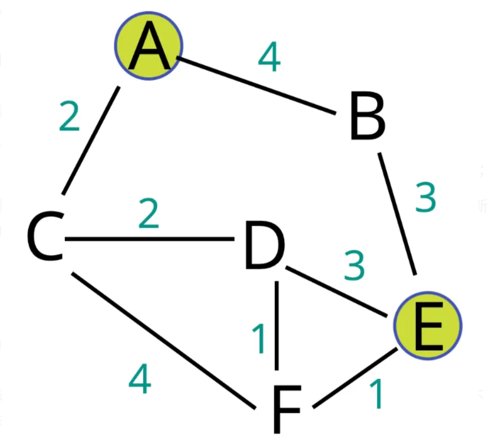

# Dijkstra Algorithm
1. 給定一個起點src，計算src到其他點的最短距離
2. 此方法只適用於單一起點(單源)，無法得知非起點到其他點的最短路徑
3. 圖形中不可有負邊
4. 想法類似於bfs，但每次選取目前coast最小的edge執行 (以min heap實做)
5. 因為每次都挑選最小coast edge，因此是greedy的一種
6. Time Complexity: O($(E + V)logV$)

## Example


Start from node A, and the dst is E find the shortest path

1. Initial the distance start from A
   dist = [0, inf, inf, inf, inf, inf]
   heap = [A-C, A-B]
2. Take edge A-C action
   [0, inf, 2, inf, inf, inf]
   heap = [C-D, A-B, C-F]
3. Take edge C-D action
   [0, inf, 2, 4, inf, inf]
   heap = [D-F, D-E, A-B, C-F]
4. Take edge D-F action
   [0, inf, 2, 4, inf, 5]
   heap = [F-E, D-E, A-B, C-F]
5. Take edge F-E action
   [0, inf, 2, 4, 6, 5]
   heap = [B-E, D-E, A-B, C-F]
6. Take edge B-E action
   [0, 9, 2, 4, 6, 5]
   heap = [D-E, A-B, C-F]
7. Take edge D-E action
   [0, 9, 2, 4, 6, 5]
   heap = [A-B, C-F]
8. Take edge A-B action
   [0, 4, 2, 4, 6, 5]
   heap = [C-F]
9. Take edge C-F action
   [0, 4, 2, 4, 6, 5]
   heap = []
10. ans = 6

## Implement
### C++
```cpp=
#include <bits/stdc++.h>

using namespace std;

class Dijkstra
{
	private:
		int n;
		vector<vector<pair<int, int>>> graph;
		priority_queue<pair<int, int>, vector<pair<int, int>>, greater<pair<int, int>>> min_heap;
	public:
		Dijkstra(vector<vector<pair<int, int>>> &g)
		{
			graph = g;
			n = g.size();
		}

		int find_shortest_path(int src, int dst)
		{
			vector<int> shortest_path(n, INT_MAX);
			shortest_path[src] = 0;

			min_heap.push({src, 0});
			
			while(!min_heap.empty())
			{
				int curr = min_heap.top().first;
				int dist = min_heap.top().second;
				min_heap.pop();

				if(dist > shortest_path[curr])
					continue;

				shortest_path[curr] = dist;

				for(pair<int, int> g : graph[curr])
				{
					int post = g.first;
					int coast = g.second + dist;

					min_heap.push({post, coast});
				}
			}

			return shortest_path[dst];
		}
};
```

### Python
```python=
import heapq

class Dijkstra:
    def __init__(self, graph: list[list[list[int]]]):
        self.graph = graph
        self.n = len(graph)
        self.min_heap = []

    def find_shortest_path(self, src: int, dst: int) -> int:
        shortest = [float("inf") for i in range(self.n)]
        shortest[0] = 0

        heapq.heappush(self.min_heap, [src, 0])

        while len(self.min_heap) != 0:
            curr, dist = heapq.heappop(self.min_heap)

            if dist > shortest[curr]:
                continue

            shortest[curr] = dist

            for g in self.graph[curr]:
                post = g[0]
                coast = g[1] + dist

                heapq.heappush(self.min_heap, [post, coast])

        return int(shortest[dst])
```

###### `heap` `Graph` `greedy` `BFS`
