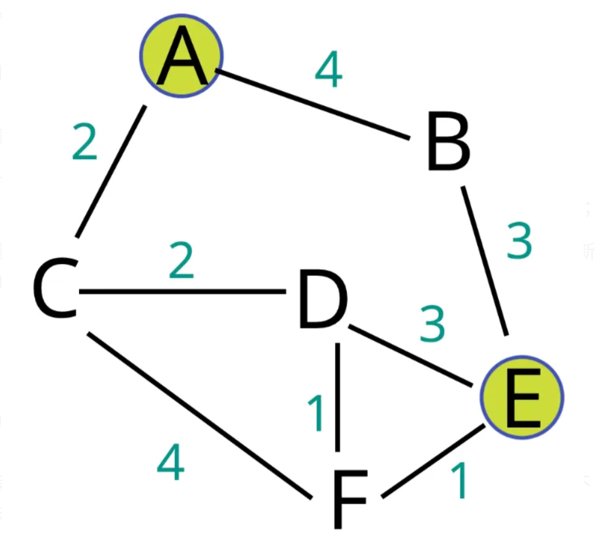

# Floyd Warshall
計算任意兩點之間的最短距離

想法上是要計算點i和j之間的最短距離，可以計算假設經過中繼點k是否會使i, j的距離縮短

即 Dist[i][j] > Dist[i][k] + Dist[k][j] ?

1. 可以有負邊，但不能有負cycle
2. 可以計算有向圖遞移閉包
3. 因為會將最短距離記錄起來，因此是DP的一種
4. Time Complexity: O($n^{3}$)

## Example




1. Initial dist table for graph

|     |  A  |  B  |  C  |  D  |  E  |  F  |
| --- | --- | --- | --- | --- | --- | --- |
|  A  |  0  |  4  |  2  | INF | INF | INF |
|  B  |  4  |  0  | INF | INF |  3  | INF |
|  C  |  2  | INF |  0  |  2  | INF |  4  |
|  D  | INF | INF |  2  |  0  |  3  |  1  |
|  E  | INF |  3  | INF |  3  |  0  |  1  |
|  F  | INF | INF |  4  |  1  |  1  |  0  |

2. update dist between every node

|     |  A  |  B  |  C  |  D  |  E  |  F  |
| --- | --- | --- | --- | --- | --- | --- |
|  A  |  0  |  4  |  2  | INF | INF | INF |
|  B  |  4  |  0  |  6  | INF |  3  | INF |
|  C  |  2  | INF |  0  |  2  | INF |  4  |
|  D  | INF | INF |  2  |  0  |  3  |  1  |
|  E  | INF |  3  | INF |  3  |  0  |  1  |
|  F  | INF | INF |  4  |  1  |  1  |  0  |

|     |  A  |  B  |  C  |  D  |  E  |  F  |
| --- | --- | --- | --- | --- | --- | --- |
|  A  |  0  |  4  |  2  | INF | INF | INF |
|  B  |  4  |  0  |  6  | INF |  3  | INF |
|  C  |  2  |  6  |  0  |  2  | INF |  4  |
|  D  | INF | INF |  2  |  0  |  3  |  1  |
|  E  | INF |  3  | INF |  3  |  0  |  1  |
|  F  | INF | INF |  4  |  1  |  1  |  0  |

|     |  A  |  B  |  C  |  D  |  E  |  F  |
| --- | --- | --- | --- | --- | --- | --- |
|  A  |  0  |  4  |  2  | INF |  7  | INF |
|  B  |  4  |  0  |  6  | INF |  3  | INF |
|  C  |  2  |  6  |  0  |  2  | INF |  4  |
|  D  | INF | INF |  2  |  0  |  3  |  1  |
|  E  | INF |  3  | INF |  3  |  0  |  1  |
|  F  | INF | INF |  4  |  1  |  1  |  0  |

|     |  A  |  B  |  C  |  D  |  E  |  F  |
| --- | --- | --- | --- | --- | --- | --- |
|  A  |  0  |  4  |  2  | INF |  7  | INF |
|  B  |  4  |  0  |  6  | INF |  3  | INF |
|  C  |  2  |  6  |  0  |  2  |  9  |  4  |
|  D  | INF | INF |  2  |  0  |  3  |  1  |
|  E  | INF |  3  | INF |  3  |  0  |  1  |
|  F  | INF | INF |  4  |  1  |  1  |  0  |

|     |  A  |  B  |  C  |  D  |  E  |  F  |
| --- | --- | --- | --- | --- | --- | --- |
|  A  |  0  |  4  |  2  | INF |  7  | INF |
|  B  |  4  |  0  |  6  | INF |  3  | INF |
|  C  |  2  |  6  |  0  |  2  |  9  |  4  |
|  D  | INF | INF |  2  |  0  |  3  |  1  |
|  E  |  7  |  3  | INF |  3  |  0  |  1  |
|  F  | INF | INF |  4  |  1  |  1  |  0  |

|     |  A  |  B  |  C  |  D  |  E  |  F  |
| --- | --- | --- | --- | --- | --- | --- |
|  A  |  0  |  4  |  2  | INF |  7  | INF |
|  B  |  4  |  0  |  6  | INF |  3  | INF |
|  C  |  2  |  6  |  0  |  2  |  9  |  4  |
|  D  | INF | INF |  2  |  0  |  3  |  1  |
|  E  |  7  |  3  |  9  |  3  |  0  |  1  |
|  F  | INF | INF |  4  |  1  |  1  |  0  |

|     |  A  |  B  |  C  |  D  |  E  |  F  |
| --- | --- | --- | --- | --- | --- | --- |
|  A  |  0  |  4  |  2  | INF |  7  | INF |
|  B  |  4  |  0  |  6  | INF |  3  | INF |
|  C  |  2  |  6  |  0  |  2  |  9  |  4  |
|  D  | INF | INF |  2  |  0  |  3  |  1  |
|  E  |  7  |  3  |  9  |  3  |  0  |  1  |
|  F  | INF | INF |  4  |  1  |  1  |  0  |

|     |  A  |  B  |  C  |  D  |  E  |  F  |
| --- | --- | --- | --- | --- | --- | --- |
|  A  |  0  |  4  |  2  |  4  |  7  | INF |
|  B  |  4  |  0  |  6  | INF |  3  | INF |
|  C  |  2  |  6  |  0  |  2  |  9  |  4  |
|  D  | INF | INF |  2  |  0  |  3  |  1  |
|  E  |  7  |  3  |  9  |  3  |  0  |  1  |
|  F  | INF | INF |  4  |  1  |  1  |  0  |

|     |  A  |  B  |  C  |  D  |  E  |  F  |
| --- | --- | --- | --- | --- | --- | --- |
|  A  |  0  |  4  |  2  |  4  |  7  |  6  |
|  B  |  4  |  0  |  6  | INF |  3  | INF |
|  C  |  2  |  6  |  0  |  2  |  9  |  4  |
|  D  | INF | INF |  2  |  0  |  3  |  1  |
|  E  |  7  |  3  |  9  |  3  |  0  |  1  |
|  F  | INF | INF |  4  |  1  |  1  |  0  |

|     |  A  |  B  |  C  |  D  |  E  |  F  |
| --- | --- | --- | --- | --- | --- | --- |
|  A  |  0  |  4  |  2  |  4  |  7  |  6  |
|  B  |  4  |  0  |  6  |  8  |  3  | INF |
|  C  |  2  |  6  |  0  |  2  |  9  |  4  |
|  D  | INF | INF |  2  |  0  |  3  |  1  |
|  E  |  7  |  3  |  9  |  3  |  0  |  1  |
|  F  | INF | INF |  4  |  1  |  1  |  0  |

|     |  A  |  B  |  C  |  D  |  E  |  F  |
| --- | --- | --- | --- | --- | --- | --- |
|  A  |  0  |  4  |  2  |  4  |  7  |  6  |
|  B  |  4  |  0  |  6  |  8  |  3  |  10 |
|  C  |  2  |  6  |  0  |  2  |  9  |  4  |
|  D  | INF | INF |  2  |  0  |  3  |  1  |
|  E  |  7  |  3  |  9  |  3  |  0  |  1  |
|  F  | INF | INF |  4  |  1  |  1  |  0  |

|     |  A  |  B  |  C  |  D  |  E  |  F  |
| --- | --- | --- | --- | --- | --- | --- |
|  A  |  0  |  4  |  2  |  4  |  7  |  6  |
|  B  |  4  |  0  |  6  |  8  |  3  |  10 |
|  C  |  2  |  6  |  0  |  2  |  9  |  4  |
|  D  |  4  | INF |  2  |  0  |  3  |  1  |
|  E  |  7  |  3  |  9  |  3  |  0  |  1  |
|  F  | INF | INF |  4  |  1  |  1  |  0  |

|     |  A  |  B  |  C  |  D  |  E  |  F  |
| --- | --- | --- | --- | --- | --- | --- |
|  A  |  0  |  4  |  2  |  4  |  7  |  6  |
|  B  |  4  |  0  |  6  |  8  |  3  |  10 |
|  C  |  2  |  6  |  0  |  2  |  9  |  4  |
|  D  |  4  |  8  |  2  |  0  |  3  |  1  |
|  E  |  7  |  3  |  9  |  3  |  0  |  1  |
|  F  | INF | INF |  4  |  1  |  1  |  0  |

|     |  A  |  B  |  C  |  D  |  E  |  F  |
| --- | --- | --- | --- | --- | --- | --- |
|  A  |  0  |  4  |  2  |  4  |  7  |  6  |
|  B  |  4  |  0  |  6  |  8  |  3  |  10 |
|  C  |  2  |  6  |  0  |  2  |  9  |  4  |
|  D  |  4  |  8  |  2  |  0  |  3  |  1  |
|  E  |  7  |  3  |  9  |  3  |  0  |  1  |
|  F  |  6  | INF |  4  |  1  |  1  |  0  |

|     |  A  |  B  |  C  |  D  |  E  |  F  |
| --- | --- | --- | --- | --- | --- | --- |
|  A  |  0  |  4  |  2  |  4  |  7  |  6  |
|  B  |  4  |  0  |  6  |  8  |  3  |  10 |
|  C  |  2  |  6  |  0  |  2  |  9  |  4  |
|  D  |  4  |  8  |  2  |  0  |  3  |  1  |
|  E  |  7  |  3  |  9  |  3  |  0  |  1  |
|  F  |  6  |  10 |  4  |  1  |  1  |  0  |

|     |  A  |  B  |  C  |  D  |  E  |  F  |
| --- | --- | --- | --- | --- | --- | --- |
|  A  |  0  |  4  |  2  |  4  |  7  |  5  |
|  B  |  4  |  0  |  6  |  8  |  3  |  10 |
|  C  |  2  |  6  |  0  |  2  |  9  |  4  |
|  D  |  4  |  8  |  2  |  0  |  3  |  1  |
|  E  |  7  |  3  |  9  |  3  |  0  |  1  |
|  F  |  6  |  10 |  4  |  1  |  1  |  0  |

|     |  A  |  B  |  C  |  D  |  E  |  F  |
| --- | --- | --- | --- | --- | --- | --- |
|  A  |  0  |  4  |  2  |  4  |  7  |  5  |
|  B  |  4  |  0  |  6  |  8  |  3  |  9  |
|  C  |  2  |  6  |  0  |  2  |  9  |  4  |
|  D  |  4  |  8  |  2  |  0  |  3  |  1  |
|  E  |  7  |  3  |  9  |  3  |  0  |  1  |
|  F  |  6  |  10 |  4  |  1  |  1  |  0  |

|     |  A  |  B  |  C  |  D  |  E  |  F  |
| --- | --- | --- | --- | --- | --- | --- |
|  A  |  0  |  4  |  2  |  4  |  7  |  5  |
|  B  |  4  |  0  |  6  |  8  |  3  |  9  |
|  C  |  2  |  6  |  0  |  2  |  5  |  4  |
|  D  |  4  |  8  |  2  |  0  |  3  |  1  |
|  E  |  7  |  3  |  9  |  3  |  0  |  1  |
|  F  |  6  |  10 |  4  |  1  |  1  |  0  |

|     |  A  |  B  |  C  |  D  |  E  |  F  |
| --- | --- | --- | --- | --- | --- | --- |
|  A  |  0  |  4  |  2  |  4  |  7  |  5  |
|  B  |  4  |  0  |  6  |  8  |  3  |  9  |
|  C  |  2  |  6  |  0  |  2  |  5  |  3  |
|  D  |  4  |  8  |  2  |  0  |  3  |  1  |
|  E  |  7  |  3  |  9  |  3  |  0  |  1  |
|  F  |  6  |  10 |  4  |  1  |  1  |  0  |

|     |  A  |  B  |  C  |  D  |  E  |  F  |
| --- | --- | --- | --- | --- | --- | --- |
|  A  |  0  |  4  |  2  |  4  |  7  |  5  |
|  B  |  4  |  0  |  6  |  8  |  3  |  9  |
|  C  |  2  |  6  |  0  |  2  |  5  |  3  |
|  D  |  4  |  8  |  2  |  0  |  3  |  1  |
|  E  |  7  |  3  |  5  |  3  |  0  |  1  |
|  F  |  6  |  10 |  4  |  1  |  1  |  0  |

|     |  A  |  B  |  C  |  D  |  E  |  F  |
| --- | --- | --- | --- | --- | --- | --- |
|  A  |  0  |  4  |  2  |  4  |  7  |  5  |
|  B  |  4  |  0  |  6  |  8  |  3  |  9  |
|  C  |  2  |  6  |  0  |  2  |  5  |  3  |
|  D  |  4  |  8  |  2  |  0  |  3  |  1  |
|  E  |  7  |  3  |  5  |  3  |  0  |  1  |
|  F  |  5  |  10 |  4  |  1  |  1  |  0  |

|     |  A  |  B  |  C  |  D  |  E  |  F  |
| --- | --- | --- | --- | --- | --- | --- |
|  A  |  0  |  4  |  2  |  4  |  7  |  5  |
|  B  |  4  |  0  |  6  |  8  |  3  |  9  |
|  C  |  2  |  6  |  0  |  2  |  5  |  3  |
|  D  |  4  |  8  |  2  |  0  |  3  |  1  |
|  E  |  7  |  3  |  5  |  3  |  0  |  1  |
|  F  |  5  |  9  |  4  |  1  |  1  |  0  |

|     |  A  |  B  |  C  |  D  |  E  |  F  |
| --- | --- | --- | --- | --- | --- | --- |
|  A  |  0  |  4  |  2  |  4  |  7  |  5  |
|  B  |  4  |  0  |  6  |  8  |  3  |  9  |
|  C  |  2  |  6  |  0  |  2  |  5  |  3  |
|  D  |  4  |  8  |  2  |  0  |  3  |  1  |
|  E  |  7  |  3  |  5  |  3  |  0  |  1  |
|  F  |  5  |  9  |  3  |  1  |  1  |  0  |

|     |  A  |  B  |  C  |  D  |  E  |  F  |
| --- | --- | --- | --- | --- | --- | --- |
|  A  |  0  |  4  |  2  |  4  |  7  |  5  |
|  B  |  4  |  0  |  6  |  6  |  3  |  9  |
|  C  |  2  |  6  |  0  |  2  |  5  |  3  |
|  D  |  4  |  8  |  2  |  0  |  3  |  1  |
|  E  |  7  |  3  |  5  |  3  |  0  |  1  |
|  F  |  5  |  9  |  3  |  1  |  1  |  0  |

|     |  A  |  B  |  C  |  D  |  E  |  F  |
| --- | --- | --- | --- | --- | --- | --- |
|  A  |  0  |  4  |  2  |  4  |  7  |  5  |
|  B  |  4  |  0  |  6  |  6  |  3  |  4  |
|  C  |  2  |  6  |  0  |  2  |  5  |  3  |
|  D  |  4  |  8  |  2  |  0  |  3  |  1  |
|  E  |  7  |  3  |  5  |  3  |  0  |  1  |
|  F  |  5  |  9  |  3  |  1  |  1  |  0  |

|     |  A  |  B  |  C  |  D  |  E  |  F  |
| --- | --- | --- | --- | --- | --- | --- |
|  A  |  0  |  4  |  2  |  4  |  7  |  5  |
|  B  |  4  |  0  |  6  |  6  |  3  |  4  |
|  C  |  2  |  6  |  0  |  2  |  5  |  3  |
|  D  |  4  |  6  |  2  |  0  |  3  |  1  |
|  E  |  7  |  3  |  5  |  3  |  0  |  1  |
|  F  |  5  |  9  |  3  |  1  |  1  |  0  |

|     |  A  |  B  |  C  |  D  |  E  |  F  |
| --- | --- | --- | --- | --- | --- | --- |
|  A  |  0  |  4  |  2  |  4  |  7  |  5  |
|  B  |  4  |  0  |  6  |  6  |  3  |  4  |
|  C  |  2  |  6  |  0  |  2  |  5  |  3  |
|  D  |  4  |  6  |  2  |  0  |  3  |  1  |
|  E  |  7  |  3  |  5  |  3  |  0  |  1  |
|  F  |  5  |  4  |  3  |  1  |  1  |  0  |

|     |  A  |  B  |  C  |  D  |  E  |  F  |
| --- | --- | --- | --- | --- | --- | --- |
|  A  |  0  |  4  |  2  |  4  |  6  |  5  |
|  B  |  4  |  0  |  6  |  6  |  3  |  4  |
|  C  |  2  |  6  |  0  |  2  |  5  |  3  |
|  D  |  4  |  6  |  2  |  0  |  3  |  1  |
|  E  |  7  |  3  |  5  |  3  |  0  |  1  |
|  F  |  5  |  4  |  3  |  1  |  1  |  0  |

|     |  A  |  B  |  C  |  D  |  E  |  F  |
| --- | --- | --- | --- | --- | --- | --- |
|  A  |  0  |  4  |  2  |  4  |  6  |  5  |
|  B  |  4  |  0  |  6  |  5  |  3  |  4  |
|  C  |  2  |  6  |  0  |  2  |  5  |  3  |
|  D  |  4  |  6  |  2  |  0  |  3  |  1  |
|  E  |  7  |  3  |  5  |  3  |  0  |  1  |
|  F  |  5  |  4  |  3  |  1  |  1  |  0  |

|     |  A  |  B  |  C  |  D  |  E  |  F  |
| --- | --- | --- | --- | --- | --- | --- |
|  A  |  0  |  4  |  2  |  4  |  6  |  5  |
|  B  |  4  |  0  |  6  |  5  |  3  |  4  |
|  C  |  2  |  6  |  0  |  2  |  4  |  3  |
|  D  |  4  |  6  |  2  |  0  |  3  |  1  |
|  E  |  7  |  3  |  5  |  3  |  0  |  1  |
|  F  |  5  |  4  |  3  |  1  |  1  |  0  |

|     |  A  |  B  |  C  |  D  |  E  |  F  |
| --- | --- | --- | --- | --- | --- | --- |
|  A  |  0  |  4  |  2  |  4  |  6  |  5  |
|  B  |  4  |  0  |  6  |  5  |  3  |  4  |
|  C  |  2  |  6  |  0  |  2  |  4  |  3  |
|  D  |  4  |  5  |  2  |  0  |  3  |  1  |
|  E  |  7  |  3  |  5  |  3  |  0  |  1  |
|  F  |  5  |  4  |  3  |  1  |  1  |  0  |

|     |  A  |  B  |  C  |  D  |  E  |  F  |
| --- | --- | --- | --- | --- | --- | --- |
|  A  |  0  |  4  |  2  |  4  |  6  |  5  |
|  B  |  4  |  0  |  6  |  5  |  3  |  4  |
|  C  |  2  |  6  |  0  |  2  |  4  |  3  |
|  D  |  4  |  5  |  2  |  0  |  2  |  1  |
|  E  |  7  |  3  |  5  |  3  |  0  |  1  |
|  F  |  5  |  4  |  3  |  1  |  1  |  0  |

|     |  A  |  B  |  C  |  D  |  E  |  F  |
| --- | --- | --- | --- | --- | --- | --- |
|  A  |  0  |  4  |  2  |  4  |  6  |  5  |
|  B  |  4  |  0  |  6  |  5  |  3  |  4  |
|  C  |  2  |  6  |  0  |  2  |  4  |  3  |
|  D  |  4  |  5  |  2  |  0  |  2  |  1  |
|  E  |  6  |  3  |  5  |  3  |  0  |  1  |
|  F  |  5  |  4  |  3  |  1  |  1  |  0  |

|     |  A  |  B  |  C  |  D  |  E  |  F  |
| --- | --- | --- | --- | --- | --- | --- |
|  A  |  0  |  4  |  2  |  4  |  6  |  5  |
|  B  |  4  |  0  |  6  |  5  |  3  |  4  |
|  C  |  2  |  6  |  0  |  2  |  4  |  3  |
|  D  |  4  |  5  |  2  |  0  |  2  |  1  |
|  E  |  6  |  3  |  4  |  3  |  0  |  1  |
|  F  |  5  |  4  |  3  |  1  |  1  |  0  |

|     |  A  |  B  |  C  |  D  |  E  |  F  |
| --- | --- | --- | --- | --- | --- | --- |
|  A  |  0  |  4  |  2  |  4  |  6  |  5  |
|  B  |  4  |  0  |  6  |  5  |  3  |  4  |
|  C  |  2  |  6  |  0  |  2  |  4  |  3  |
|  D  |  4  |  5  |  2  |  0  |  2  |  1  |
|  E  |  6  |  3  |  4  |  2  |  0  |  1  |
|  F  |  5  |  4  |  3  |  1  |  1  |  0  |

## Implement
### C++
```cpp=
#include <bits/stdc++.h>

using namespace std;

class floyd_warshall
{
	private:
		vector<vector<int>> dist;
		int n;
	public:
		floyd_warshall(vector<vector<pair<int, int>>> &g)
		{
			n = g.size();
			dist.resize(n, vector<int>(n, INT_MAX));
			for(int i = 0; i < n; i++)
			{
				dist[i][i] = 0;
				for(pair<int, int> edge : g[i])
					dist[i][edge.first] = edge.second;
			}
		}

		void calculate_shortest()
		{
			for(int k = 0; k < n; k++)
				for(int i = 0; i < n; i++)
					for(int j = 0; j < n; j++)
						if(dist[i][j] > (dist[i][k] + dist[k][j]) && dist[i][k] != INT_MAX && dist[k][j] != INT_MAX)
							dist[i][j] = dist[i][k] + dist[k][j];
		}

		int shortest(int src, int dst)
		{
			return dist[src][dst];
		}
};
```

### Python
```python=
class floyd_warshall:
    def __init__(self, graph):
        self.n = len(graph)
        self.dist = [[float("inf") for i in range(self.n)] for j in range(self.n)]

        for i in range(self.n):
            self.dist[i][i] = 0
            for edge in graph[i]:
                self.dist[i][edge[0]] = edge[1]

    def calculate_shortest(self):
        for k in range(self.n):
            for i in range(self.n):
                for j in range(self.n):
                    if self.dist[i][j] > self.dist[i][k] + self.dist[k][j] and self.dist[i][k] != float("inf") and self.dist[k][j] != float("inf"):
                        self.dist[i][j] = self.dist[i][k] + self.dist[k][j]

    def shortest(self, src, dst):
        return self.dist[src][dst]
```

###### `DP` `graph`
