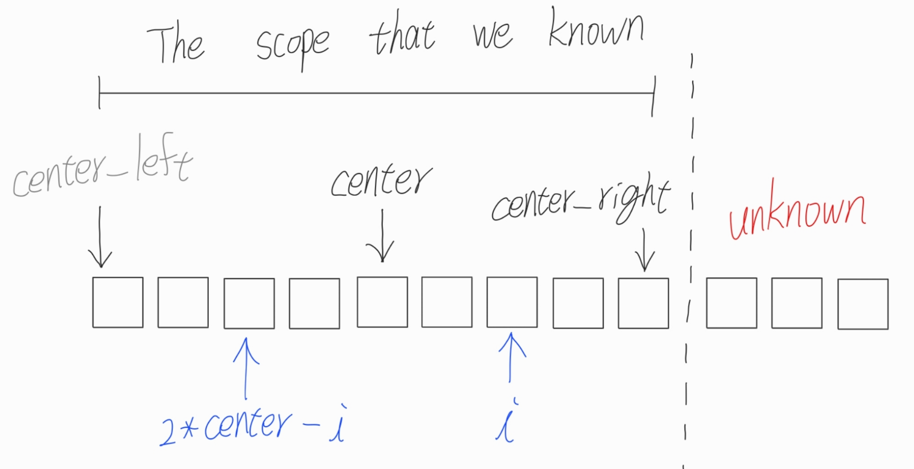
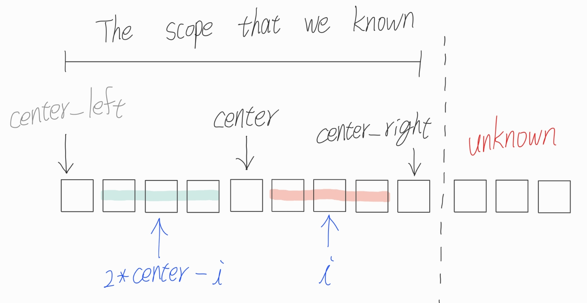
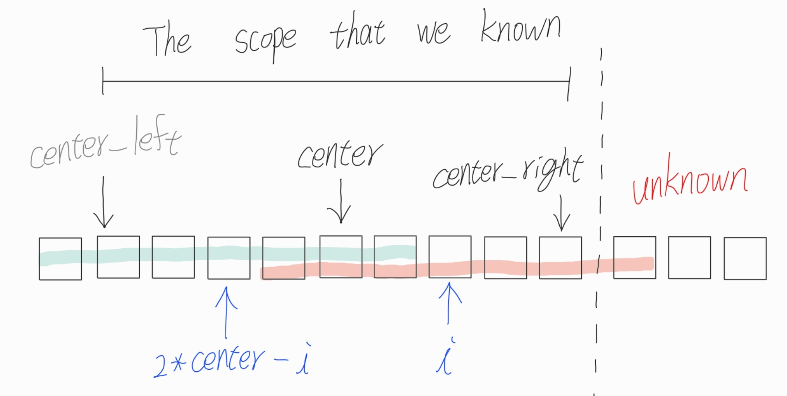
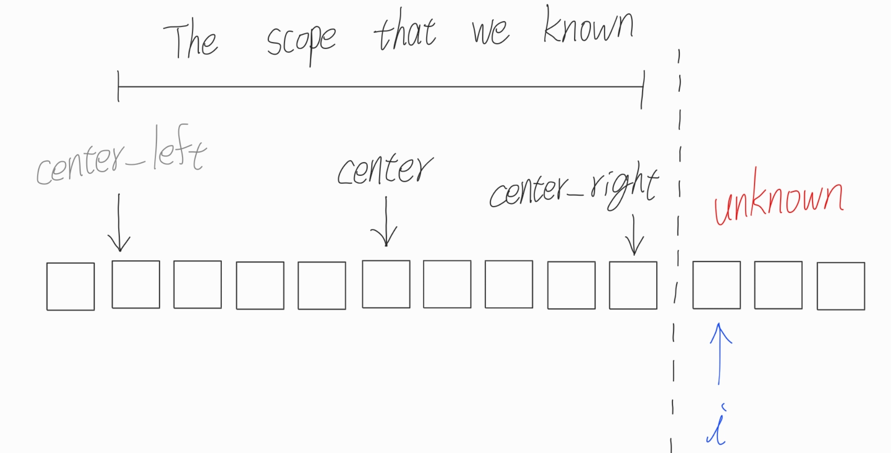

# Manacher's algo
用於搜尋longest palindromic substring (LPS) 的演算法  
在解決LPS最直覺的方法就是用brute force或DP的方式來解決

|Brute force|    DP     |
|:---------:|:---------:|
|把所有substring列出來並檢查是否為palindrome|若$S_{i}$到$S_{j}$為回文且$S_{i-1} = S_{j+1}$則$S_{i-1}$到$S_{j+1}$為回文|
|Time complexity: O($n^{3}$)| Time complexity: O($n^{2}$)|
|Space complexity: O(n)| Space complexity: O($n^{2}$)|

Manacher's algo可以透過紀錄以目前所在位置為中心往外延伸的LPS length，使time complexity降至O(n)  
本質上還是中心展開法，但會把前面展開的資訊做紀錄

LPS length半徑: 以目前位置為中心可以到達往右和往左的長度  
此時的string是已經加過#的，同時也是origin string的LPS length  
```
string adding #  : # a # b # a # b # a #
LPS_length radius: 0 1 0 3 0 5 0 3 0 1 0
```
我們以正中心的a為例，其LPS length半徑為5表示以此點為中心可以分別往左往右5

## Step
以string "babcbabcbaccba" 為例
1. 先對所有string的char間隔中插入一個不會出現在string的字元(以#為例)
   ```
   ababa => #b#a#b#c#b#a#b#c#b#a#c#c#b#a#
   ```
   加入字元可以避免palidrome長度為偶數導致中心點落在2個char之間的情況(以abba為例)
   ```
   abba => #a#b#b#a# , 中心點落在第三個#
   ```
2. Initial 一個LPS_length的table，此table紀錄這以此index為中心的LPS length半徑 = 0
   ```
   string adding # : # b # a # b # c # b # a # b # c # b # a # c # c # b # a #
   LPS_length table: 0 0 0 0 0 0 0 0 0 0 0 0 0 0 0 0 0 0 0 0 0 0 0 0 0 0 0 0 0
   ```
3. 更新LPS_length table，下面是更新完後的樣子
   ```
   string adding # : # b # a # b # c # b # a # b # c # b # a # c # c # b # a #
   finished table  : 0 1 0 3 0 1 0 7 0 1 0 9 0 1 0 5 0 1 0 1 0 1 2 1 0 1 0 1 0
   ```
   那如何進行更新呢?  
   如同前面所說，我們可以利用前面已知的LPS來先為目前所在位置的LPS_length table進行initialize  

   假設我們現在所在的位置在index i，我們已知我們目前能看最遠的LPS中心在center，能看到最遠center_right  
   這表示我們從center到center_right和center到center_left是對稱的(code裡不會紀錄center_left)如下圖  
   

   理論上我們現在所在的index i若在我們能看到的最遠範圍內(center_right)  
   那LPS_length table應該要和LPS_length table index (2\*center - i) 一樣(因為對稱)

   但實際上在inital LPS_length table會有**三種**case:
   1. LPS_lenth table (2\*center - i)的長度 + i < center_right (表示沒超出我們目前能看的最遠範圍)如下圖  
      此時LPS_length table (i) = LPS_length table (2\*center - i)  
      

   2. LPS_length table (2\*center - i)的長度 + i >= center_right (表示我們只能確定以i為center到center_right為止是有對稱的，後面目前還不知道)如下圖  
      此時LPS_length table (i) = center_right - i  
      

   3. i >= center_right (表示我們無法利用palidrome的特性來initial LPS_length table)如下圖  
      此時LPS_length table (i) = 0
      

   Initial完後就開始往左往右檢查char是否一樣來更新LPS_length table

## Implement
### C++
### Python
```python=
class manacher:
    def __init__(self, s: str):
        #original string
        self.s = s

        self.new_s = '#'
        for i in range(len(self.s)):
            self.new_s += self.s[i]
            self.new_s += '#'

        self.n = len(self.new_s)
        self.lps_table = [0] * self.n

    def lps(self):
        #center: 我們能看到最右邊的palidrome的center
        center = 1
        #center_right: 我們能看到最遠的位置
        center_right = 2
        #max_len: current lps length
        max_len = 0
        #lps_center: current lps center
        lps_center = 0

        #start from index 1, because index 0 will always be 0
        for i in range(1, self.n):
            if i < center_right:
                #we can initial that the lps of i is case 1 or case 2
                self.lps_table[i] = min(self.lps_table[2*center - i], center_right - i)
            else:
                #i >= center_right means we cann't use the feature of palidrome to initalize lps
                self.lps_table[i] = 0

            #update the length of palidrome that i is the center
            while (i - self.lps_table[i] - 1 >= 0 and \
                   i + self.lps_table[i] + 1 < self.n and \
                   self.new_s[i - self.lps_table[i] - 1] == self.new_s[i + self.lps_table[i] + 1]):
                self.lps_table[i] += 1
            
            #update lps
            if self.lps_table[i] > max_len:
                max_len = self.lps_table[i]
                lps_center = i

            #update center and center_right
            if i + self.lps_table[i] - 1 > center_right:
                center_right = i + self.lps_table[i] - 1
                center = i

        start = int((lps_center - max_len) / 2)

        return self.s[start : start + max_len]
```
