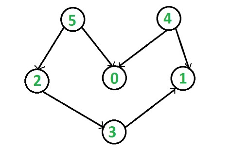

# Topological Sort
- Need to be DAG(Directed Acyclic Graph)
- There may be more than one result
- Time complexity : O(V+E) (V: vertex, E: edge)
- Space complexity : O(V)
- vertex(x) need to appear before vertex(y)
  EX: vertex(4) need to appear vertex(0)
  

    | vertex |   |   |
    | ------ | - | - |
    | 0      |   |   |
    | 1      |   |   |
    | 2      | 3 |   |
    | 3      | 1 |   |
    | 4      | 0 | 1 |
    | 5      | 0 | 2 |
    
    This two topological sort result in this case is acceptable:
    5, 4, 2, 3, 1, 0
    4, 5, 2, 3, 1, 0

## Implement
### C++
```cpp=
class topological_sort
{
    public:
        vector<vector<int>> graph;
        vector<bool> visited;
        stack<int> stk;
    
        topological_sort(vector<vector<int>> g)
        {
            this.graph.insert(this.graph.end(), g.begin(), g.end());
            this.visited.resize(g.size(), false);
        }
    
        void _sort(int point)
        {
            if(!visited[point])
            {
                visited[point] = True;
                
                for(int p : graph[point])
                    if(!visited[p])
                        _sort(p);
            }
            
            stk.push(point);
        }
        
        void print_res()
        {
            for(int i : graph)
                if(!visited[i])
                    _sort(i);
            
            while(!stk.empty())
            {
                cout << stk.top() << " ";
                stk.pop();
            }
            cout << endl;
        }
};
```

### Python
```python=
class topological_sort:
    def __init__(self, graph: List[List[int]]):
        self.graph = graph
        self.visited = [False]*len(self.graph)
        self.stk = []
    
    def _sort(self, point: int):
        if not self.visited[point]:
            self.visited[point] = True
            for p in self.graph[point]:
                if not self.visited[p]:
                    self._sort(p)
                    
        self.stk.append(point)
    
    def print_res(self):
        for i in range(len(self.graph)):
            if not self.visited[i]:
                self._sort(i)
        
        print(reversed(self.stk))
```

###### tag : `Graph` `DFS`
