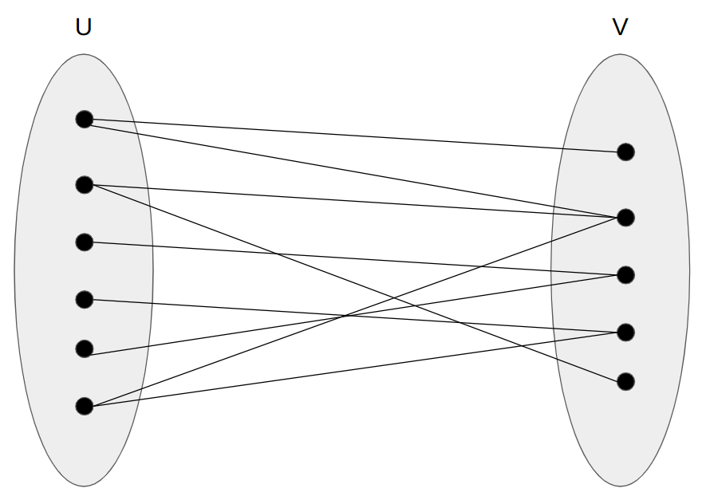
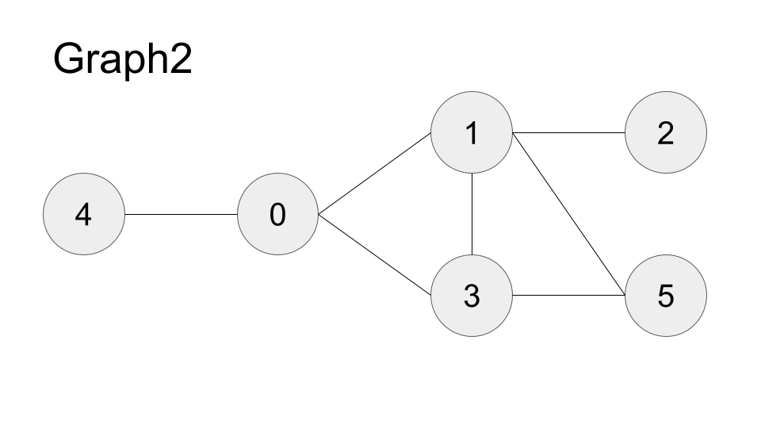

# Bipartite graph
Bipartite graph (二部圖) 是一種特殊的graph，可以將所有頂點分類成兩個互斥的獨立集U & V，此graph的所有edge皆連接U中的一個node和V中的一個node，如下圖所示  



Bipartite graph具有以下特性:   
1. 無奇數長度的cycle
2. 著色數為2 (set U 一個顏色，set V 一個顏色)

## 判斷Bipartite graph的方法
1. DFS
2. BFS

DFS和BFS其實概念是一樣的只是用不同algo，皆為從一個點開始著色，若遇到矛盾則表示非Bipartite graph

## Implement
### C++
```cpp
#include <bits/stdc++.h>

using namespace std;

class BipartiteDFS{
    public:
        bool checkBipartite(vector<vector<int>> &graph){
            const int n = graph.size();
            vector<int> color(n, -1);

            for(int i = 0; i < n; i++)
            {
                if(color[i] == -1)
                {
                    if(!dfs(graph, color, i, 1))
                        return false;
                }
            }

            return true;
        }
    
    private:
        bool dfs(vector<vector<int>> &graph, vector<int> &color, int node, int curColor = 1){
            if(color[node] != -1 && color[node] != curColor)
                return false;
            else if(color[node] != -1 && color[node] == curColor)
                return true;
            
            color[node] = curColor;
            for(int nextNode : graph[node])
                if(!dfs(graph, color, nextNode, 1 - curColor))
                    return false;
            
            return true;
        }
};

class BipartiteBFS{
    public:
        bool checkBipartite(vector<vector<int>> &graph)
        {
            const int n = graph.size();
            vector<int> color(n, -1);

            for(int i = 0; i < n; i++)
            {
                if(color[i] == -1)
                {
                    if(!bfs(graph, color, i))
                        return false;
                }
            }

            return true;
        }

    private:
        bool bfs(vector<vector<int>> &graph, vector<int> &color, int node)
        {
            queue<int> q;

            int curColor = 1;
            q.push(node);
            color[node] = curColor;

            while(!q.empty())
            {
                int s = q.size();

                for(int i = 0; i < s; i++)
                {
                    int cur = q.front();
                    q.pop();

                    for(int nextNode : graph[cur])
                    {
                        if(color[nextNode] == -1)
                        {
                            color[nextNode] = 1 - curColor;
                            q.push(nextNode);
                        }
                        else
                        {
                            if(color[nextNode] == curColor)
                                return false;
                        }
                    }
                }

                curColor = 1 - curColor;
            }

            return true;
        }
};
```

### Python
```python
import queue

class BipartiteDFS:
    def checkBipartite(self, graph: list[list[int]]) -> bool:
        n = len(graph)
        color = [-1 for i in range(n)]

        for i in range(n):
            if color[i] == -1:
                if not self._dfs(graph, color, i, 1):
                    return False
        
        return True
    
    def _dfs(self,
             graph: list[list[int]],
             color: list[int],
             node: int,
             curColor: int) -> bool:
        
        if color[node] != -1 and color[node] != curColor:
            return False
        elif color[node] != -1 and color[node] == curColor:
            return True
        
        color[node] = curColor
        for nextNode in graph[node]:
            if not self._dfs(graph, color, nextNode, 1 - curColor):
                return False
        
        return True

class BipartiteBFS:
    def checkBipartite(self, graph: list[list[int]]) -> bool:
        n = len(graph)
        color = [-1 for i in range(n)]

        for i in range(n):
            if color[i] == -1:
                if not self._bfs(graph, color, i):
                    return False
        
        return True
    
    def _bfs(self,
             graph: list[list[int]],
             color: list[int],
             node: int) -> bool:
        
        q = queue.Queue()

        curColor = 1
        q.put(node)
        color[node] = curColor

        while not q.empty():
            s = q.qsize()

            for i in range(s):
                cur = q.get()

                for nextNode in graph[cur]:
                    if color[nextNode] == -1:
                        color[nextNode] = 1 - curColor
                        q.put(nextNode)
                    else:
                        if color[nextNode] == curColor:
                            return False
                
            curColor = 1 - curColor
        
        return True
```

在範例code所使用的graph1和graph2分別如下


