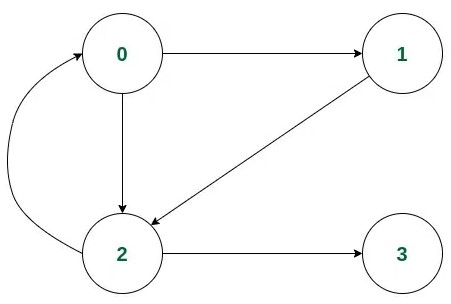

# Detect Cycle
## Using DFS
- graph : 二維vector, directed graph, graph[i]表示i可以走到哪些點
- visited : 紀錄此點是否已走過
- todo : 紀錄此點之後的點是否尚未做完(後面還有點要走，所以還要todo)  


| Point_idx |          |          |
| --------- | -------- | -------- |
| 0         | 1        | 2        |
| 1         | 2        |          |
| 2         | 0        | 3        |
| 3         |          |          |

## Implement
### C++

```cpp
class check_cycle
{
	public:
		vector<vector<int>> graph;
		vector<bool> visited;
		vector<bool> todo;
		
		check_cycle(vector<vector<int>> g)
		{
			graph = g;
			visited.resize(g.size(), false);
			todo.resize(g.size(), false);
		}

		bool _iscycle(int point)
		{
			if(!visited[point])
			{
				visited[point] = true;
				todo[point] = true;

				for(int p : graph[point])
					if(!visited[p] && _iscycle(p))
						return true;
					else if(todo[p])
						return true;
			}

			todo[point] = false;

			return false;
		}

		bool iscycle()
		{
			const int n = graph.size();
			
			for(int i = 0; i < n; i++)
				if(!visited[i] && _iscycle(i))
					return true;

			return false;
		}
};
```

### Python
```python
class check_cycle:
    def __init__(self, graph: list[list[int]]):
        self.graph = graph
        self.visited = defaultdict(bool)
        self.todo = defaultdict(bool)

    def _iscycle(self, point: int) -> bool:
        if not self.visited[point]:
            self.visited[point] = True
            self.todo[point] = True

            for p in self.graph[point]:
                if not self.visited[p] and self._iscycle(p):
                    return True
                elif self.todo[p]:
                    return True

        self.todo[point] = False

        return False

    def iscycle(self) -> bool:
        for i in range(len(self.graph)):
            if not self.visited[i] and self._iscycle(i):
                return True

        return False
```

###### tags : `Graph` `DFS`
