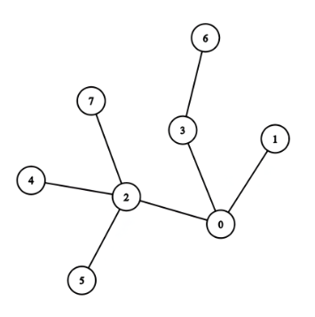

# Tree Diameter algorithm
Tree diameter是只說tree上的最遠距離 (這裡的tree其實是指無向連通無循環圖)  

在尋找tree diameter時最直觀的想法是對每一個node進行一次BFS去找最遠的距離，但實際上只要做兩次BFS即可，因此也有人稱此演算法為two-pass BFS algorithm

## 步驟
1. 先取任意一個node x進行第一次BFS，找出距離x最遠的node y   
2. 在用node y進行第二次BFS即可找到tree diameter   

## 為什麼可以做兩次BFS即可
因為第一次的BFSF所找到的node y必定會是tree diameter上的一端(或是有多條tree diameter，但必定會是其中一條tree diameter的一端)   

可以用矛盾證明法證明，假設node y並非tree diameter上的一端，則會有另一條path從node a到node b距離比從node a (or node b)到node y距離更遠   

會發現無論如何都會出現node y會是其中一端，與假設矛盾 (由於我自己的證明感覺很不嚴謹因此就不附上了)

## Implement
### C++
```cpp
#include <bits/stdc++.h>

using namespace std;

class TreeDiameter{
    public:
        int getDiameter(vector<vector<int>> &graph)
        {
            //node y and length from 0
            auto [node, dist] = bfs(graph, 0);
            auto [tmp, diameter] = bfs(graph, node);

            return diameter;
        }
    
    private:
        pair<int, int> bfs(vector<vector<int>> &graph, int node)
        {
            const int n = graph.size();
            vector<bool> visited(n, false);
            queue<int> q;
            int farest = 0, dist = 0;

            q.push(node);
            visited[node] = true;

            while(!q.empty())
            {
                int s = q.size();

                for(int i = 0; i < s; i++)
                {
                    int cur = q.front();
                    q.pop();

                    for(int nextNode : graph[cur])
                    {
                        if(visited[nextNode])
                            continue;
                        
                        q.push(nextNode);
                        visited[nextNode] = true;
                    }

                    farest = cur;
                }

                dist++;
            }

            return {farest, dist - 1};
        }
};
```
### Python
```python
import queue

class TreeDiameter:
    def getDiameter(self, graph: list[list[int]]) -> int:
        node, _ = self._bfs(graph, 0)
        _, diameter = self._bfs(graph, node)

        return diameter
    
    def _bfs(self, graph: list[list[int]], node: int) -> tuple[int, int]:
        n = len(graph)
        visited = [False for i in range(n)]
        q = queue.Queue()
        farest, dist = 0, 0

        q.put(node)
        visited[node] = True

        while not q.empty():
            s = q.qsize()

            for i in range(s):
                cur = q.get()

                for nextNode in graph[cur]:
                    if visited[nextNode]:
                        continue

                    visited[nextNode] = True
                    q.put(nextNode)
                
                farest = cur
            
            dist += 1
        
        return farest, dist - 1
```

此範例所用的graph如下圖所示

