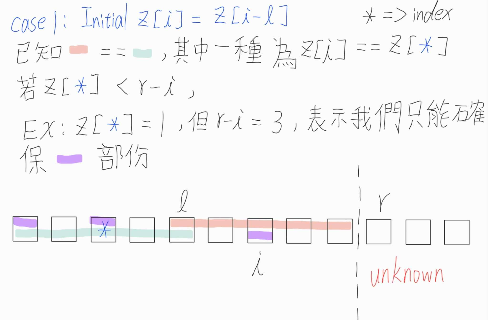
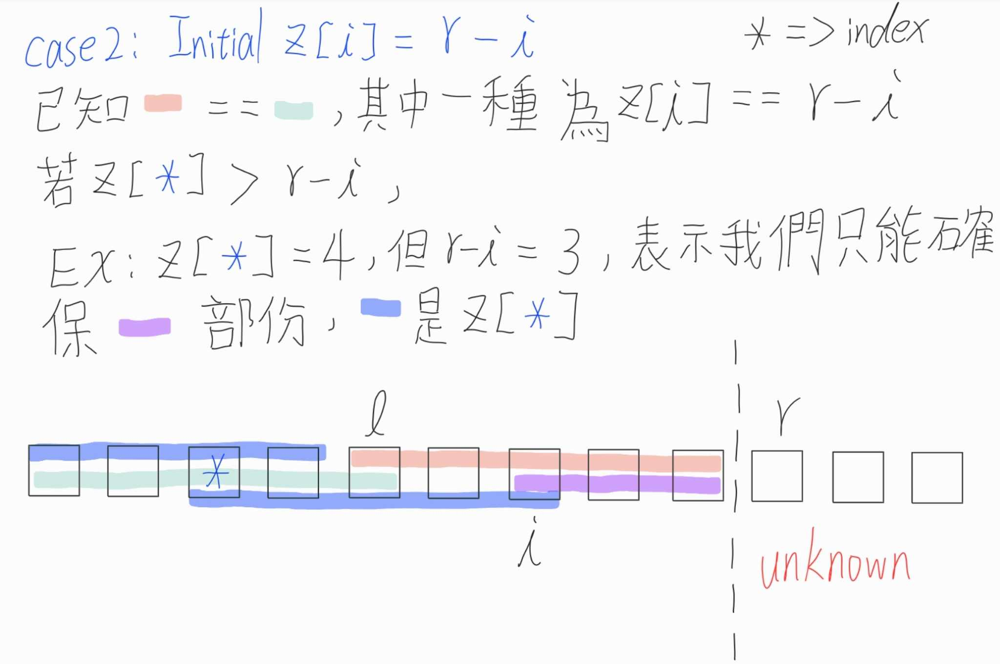
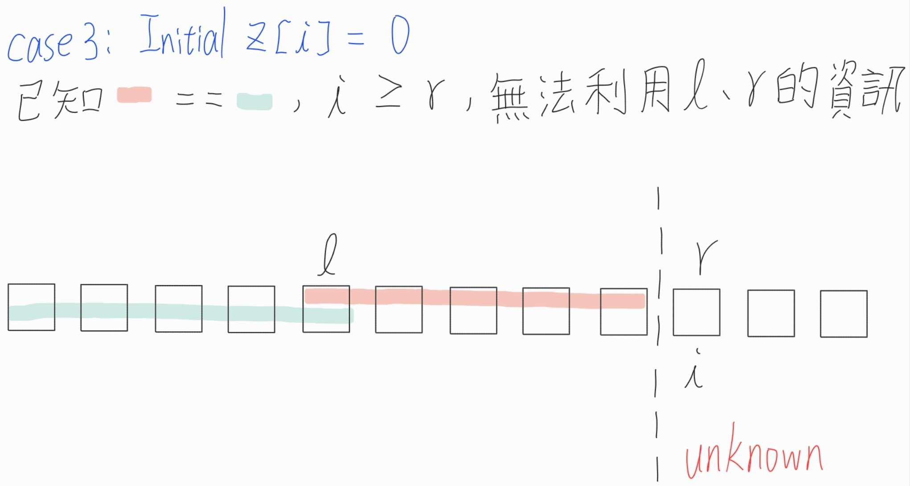

# Z function
z function是一種計算longest common prefix (lcp)的演算法 

此演算法會紀錄一個z-array (z-array長度與字串長度相同)  
在z-array中每個index i分別紀錄著從index i開始以及從頭開始相同的子字串長度

此想法和Manacher's algorithm類似，會用到前面已算過的資訊來去繼續計算，可以視為KMP的延伸

## Step
以string "aabcaabxaaaz" 為例  
1. Initial z-array: 長度為string的長度，內容全部為0  
   ```
   string : a a b c a a b x a a a z
   z-array: 0 0 0 0 0 0 0 0 0 0 0 0
   ```
   除了initial z-array以外，還會有兩個變數 l 和 r
   r => 代表我們在更新z-array時，目前我們最遠能看到的位置
   l => 目前能看到最遠的lcp的起點  

2. Iterate index i，i從1開始，因為0就是string的起點，所以lcp為0  
   i => 我們目前欲計算prefix的位置  
   在計算每個z[i]，時其實可以用到l和r的資訊來先initial z[i]，會有三種case  
   1. 我們能確認的範圍 < 我們能看到的最遠範圍，如下圖
      
   2. 我們能確認的範圍 > 我們能看到的最遠範圍，如下圖
      
   3. 目前的index i >= 我們能看到的最遠範圍，如下圖
      

3. 繼續往後確認是否有更長的prefix長度，更新z[i]

4. 確認是否有需要更新l和r

## Implement
### C++
```cpp
#include <bits/stdc++.h>

using namespace std;

class z_function
{
    public:
        vector<int> z;
        string s;
        int len;

        z_function(string str)
        {
            s = str;
            len = s.size();
            z.resize(len, 0);
        }

        void cal_z()
        {
            int l = 0, r = 0;
            for(int i = 1; i < len; i++)
            {
                if(i < r)
                    z[i] = min(r - i, z[i - l]);
                
                while(i + z[i] < len && s[z[i]] == s[i + z[i]])
                    z[i]++;
                
                if(i + z[i] > r)
                {
                    l = i;
                    r = i + z[i];
                }
            }
        }

        void show_res()
        {
            cout << "string: ";
            for(char &c : s)
                cout << c << " ";
            
            cout << endl;

            cout << "z_func: ";
            for(int i = 0; i < len; i++)
                cout << z[i] << " ";
            cout << endl;
        }
};
```

### Python
```python
class z_function:
    def __init__(self, s: str):
        self.s = s
        self.len = len(s)
        self.z = [0] * self.len
    
    def cal_z(self) -> None:
        l, r = 0, 0
        for i in range(1, self.len):
            if i < r:
                self.z[i] = min(r- i, self.z[i - l])
            
            while i + self.z[i] < self.len and self.s[self.z[i]] == self.s[i + self.z[i]]:
                self.z[i] += 1
            
            if i + self.z[i] > r:
                l = i
                r = i + self.z[i]
    
    def show_res(self) -> None:
        s_show = " ".join(self.s)
        z_show = " ".join(map(str, self.z))
        
        print(f"string: {s_show}")
        print(f"z_func: {z_show}")
```