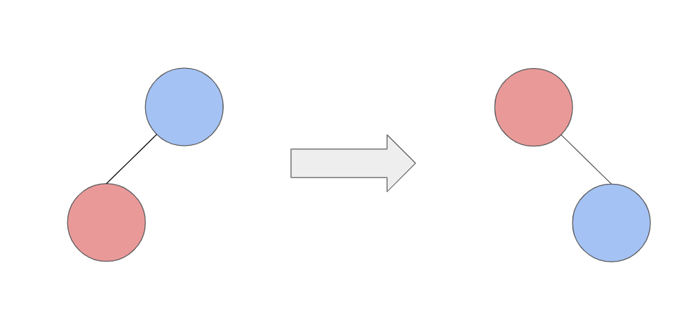
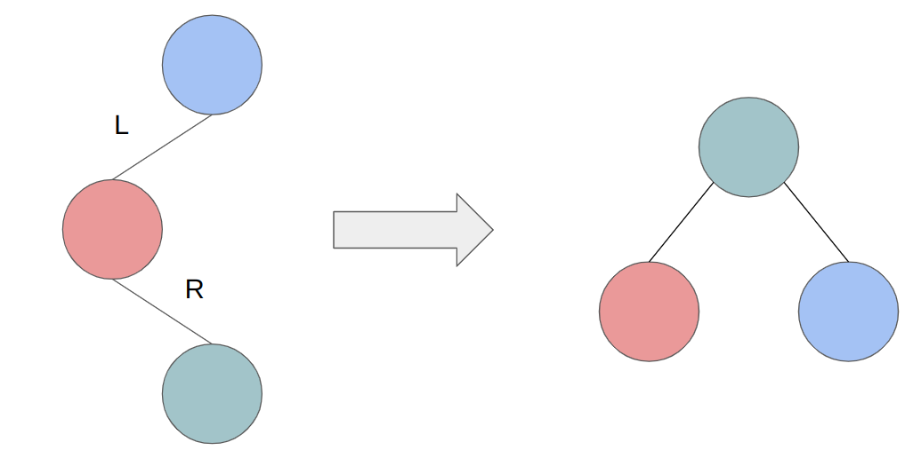

# AVL Tree
AVL tree是一種binary tree的結構，但跟一般的binary tree不同，AVL tree會保持height balance，讓在進行binary search tree時可以達到最小的搜尋成本

## Hieght balance
知道AVL tree是一個height balance的binary tree，那就要了解什麼是height balance，所以要先知道tree height (樹高) 的定義
### Tree height
tree height: 此node為root到leaf的最長的path

以下圖為例，root到left leaf的path為2，到right leaf的path為1，因此此root的height為2


可以將tree height寫成一個簡單的公式，若無child則child的height為-1
```
tree height = max(leftChildHiehgt, rightChildHeight) + 1
```

### Balance Factor
Balance factor (BF) 是AVL tree用來確認此樹是否balance的參數

BF簡單的說是leftChildHeight - rightChildHeight

BF被分為三種情況:
1. BF < -1: 表示右子樹較高，需要調整
2. -1 <= BF <= 1: 表示目前平衡，無需調整
3. BF > 1: 表示左子樹較高，需要調整

下圖為計算每個node的BF例子


### Rotation
當計算完BF後，若有unbalance的情況則需要進行rotation，使得tree balance

\*要注意做完rotation要讓inorder維持跟原tree的inorder相同(否則無法做BST)

Rotation有兩種:
1. Left rotation ( L )

   讓樹以逆時針的方式旋轉，如下圖
   
2. Right rotation ( R )

   讓樹以順時針的方式旋轉，如下圖
   

Unbalance可以分為4種情況(以圖示說明):
1. LL
   
2. LR
   
3. RL
   
4. LR
   

## Time & Space complexity
AVL tree的空間複雜度為O(n)，n為tree node個數
### Search
Search和BST相同

Time: O($log_{n}$)

### Insert Node
Insert和BST時間空間複雜度相同，差別在於每次insert要確認tree height是否balance

Time: O($log_{n}$)

### Delete Node
Delete和insert相同，每次都異確認tree height

Time: O($log_{n})

## Implement
### C++
```cpp
#include <bits/stdc++.h>

using namespace std;

struct Node
{
	int val;
	int height;
	int BF;
	Node *left;
	Node *right;

	Node(): val(0), height(0), BF(0), left(nullptr), right(nullptr) {}
	Node(int v): val(v), height(0), BF(0), left(nullptr), right(nullptr) {}
};

class AVL_tree
{
	private:
		Node* findMax(Node *root)
		{
			if(!root)
				return nullptr;

			return root->right ? findMax(root->right) : root;
		}

		void update_h_bf(Node *root)
		{
			if(!root)
				return;

			int l = root->left ? root->left->height : -1;
			int r = root->right ? root->right->height : -1;

			root->height = max(l, r) + 1;
			root->BF = l - r;
		}

		void _inorder(Node *root)
		{
			if(!root)
				return;

			_inorder(root->left);
			cout << root->val << " ";
			_inorder(root->right);
		}

		void _preorder(Node *root)
		{
			if(!root)
				return;
			cout << root->val << " ";
			_preorder(root->left);
			_preorder(root->right);
		}

		Node* left_rotation(Node *root)
		{
			Node *r = root->right;
			Node *r_lchild = r->left;

			r->left = root;
			root->right = r_lchild;

			update_h_bf(root);
			update_h_bf(r);

			return r;
		}

		Node* right_rotation(Node *root)
		{
			Node *l = root->left;
			Node *l_rchild = l->right;

			l->right = root;
			root->left = l_rchild;

			update_h_bf(root);
			update_h_bf(l);

			return l;
		}

		Node* _insert_node(Node *root, Node *n)
		{
			if(!root)
			{
				root = n;
				return root;
			}

			if(n->val > root->val)
				root->right = _insert_node(root->right, n);
			else
				root->left = _insert_node(root->left, n);

			update_h_bf(root);

			if(root->BF > 1)
			{
				// LL type
				if(root->left->val >= 0)
					return right_rotation(root);
				//LR type
				else
				{
					root->left = left_rotation(root->left);
					return right_rotation(root);
				}
			}
			else if(root->BF < -1)
			{
				//RR type
				if(root->right->BF <= 0)
					return left_rotation(root);
				//RL type
				else
				{
					root->right = right_rotation(root->right);
					return left_rotation(root);
				}
			}

			return root;
		}

		Node* _delete_node(Node *root, int val)
		{
			if(!root)
				return nullptr;

			if(val > root->val)
				root->right = _delete_node(root->right, val);
			else if(val < root->val)
				root->left = _delete_node(root->left, val);
			else
			{
				if(!root->left && !root->right)
				{
					delete root;
					return nullptr;
				}
				else if(!root->left)
				{
					Node *tmp = root->right;
					delete root;
					return tmp;
				}
				else if(!root->right)
				{
					Node *tmp = root->left;
					delete root;
					return tmp;
				}
				else
				{
					Node *max_l = findMax(root->left);
					swap(root->val, max_l->val);
					root->left = _delete_node(root->left, val);
				}
			}

			update_h_bf(root);

			if(root->BF > 1)
			{
				// LL type
				if(root->left->BF >= 0)
					return right_rotation(root);
				//LR type
				else
				{
					root->left = left_rotation(root->left);
					return right_rotation(root);
				}
			}
			else if(root->BF < -1)
			{
				//RR type
				if(root->right->BF <= 0)
					return left_rotation(root);
				//RL type
				else
				{
					root->right = right_rotation(root->right);
					return left_rotation(root);
				}
			}

			return root;
		}

	public:
		Node *root;
		
		AVL_tree()
		{
			root = nullptr;
		}

		void inorder()
		{
			_inorder(this->root);
			cout << endl;
		}

		void preorder()
		{
			_preorder(this->root);
			cout << endl;
		}

		void insert_node(int val)
		{
			Node *n = new Node(val);
			this->root = _insert_node(this->root, n);
		}

		void delete_node(int val)
		{
			_delete_node(this->root, val);
		}
};
```

### Python
```python
class Node:
    def __init__(self, val: int = 0):
        self.val = val
        self.h = 0
        self.BF = 0
        self.left = None
        self.right = None

class AVL_tree:
    def __init__(self):
        self.root = None

    def inorder(self) -> None:
        print('Inorder:', end=' ')
        self._inorder(self.root)
        print('')

    def preorder(self) -> None:
        print('Preorder:', end=' ')
        self._preorder(self.root)
        print('')

    def insert_node(self, val: int) -> None:
        n = Node(val)
        self.root = self._insert_node(self.root, n)

    def delete_node(self, val: int) -> None:
        self.root = self._delete_node(self.root, val)

    def _inorder(self, root: Node) -> None:
        if root is None:
            return

        self._inorder(root.left)
        print('{}'.format(root.val), end=' ')
        self._inorder(root.right)

    def _preorder(self, root: Node) -> None:
        if root is None:
            return

        print('{}'.format(root.val), end=' ')
        self._preorder(root.left)
        self._preorder(root.right)

    def _insert_node(self, root: Node, n: Node) -> Node:
        if root is None:
            root = n
            return root

        if n.val > root.val:
            root.right = self._insert_node(root.right, n)
        else:
            root.left = self._insert_node(root.left, n)

        self._update_h_bf(root)

        if root.BF > 1:
            #LL type
            if root.left.BF >= 0:
                return self._right_rotation(root)
            #LR type
            else:
                root.left = self._left_rotation(root.left)
                return self._right_rotation(root)

        elif root.BF < -1:
            #RR type
            if root.right.BF <= 0:
                return self._left_rotation(root)
            #RL type
            else:
                root.right = self._right_rotation(root.right)
                return self._left_rotation(root)

        return root

    def _delete_node(self, root: Node, val: int) -> Node:
        if root is None:
            return None

        if val > root.val:
            root.right = self._delete_node(root.right, val)
        elif val < root.val:
            root.left = self._delete_node(root.left, val)
        else:
            if not root.left and not root.right:
                del root
                return None

            elif not root.left:
                tmp = root.right
                del root
                return tmp

            elif not root.right:
                tmp = root.left
                del root
                return tmp

            else:
                max_l = self._findMax(root.left)
                root.val, max_l.val = max_l.val, root.val
                root.left = self._delete_node(root.left, val)

        self._update_h_bf(root)

        if root.BF > 1:
            #LL type
            if root.left.BF >= 0:
                return self._right_rotation(root)
            #LR type
            else:
                root.left = self._left_rotation(root.left)
                return self._right_rotation(root)

        elif root.BF < -1:
            #RR type
            if root.right.BF <= 0:
                return self._left_rotation(root)
            #RL type
            else:
                root.right = self._right_rotation(root.right)
                return self._left_rotation(root)

        return root

    def _findMax(self, root: Node) -> Node:
        if root is None:
            return None

        return self._findMax(root.right) if root.right is not None else root

    def _update_h_bf(self, root: Node) -> None:
        if root is None:
            return

        l = root.left.h if root.left is not None else -1
        r = root.right.h if root.right is not None else -1

        root.h = max(l, r) + 1
        root.BF = l - r

    def _left_rotation(self, root: Node) -> Node:
        r = root.right
        r_lchild = r.left

        r.left = root
        root.right = r_lchild

        self._update_h_bf(root)
        self._update_h_bf(r)

        return r

    def _right_rotation(self, root: Node) -> Node:
        l = root.left
        l_rchild = l.right

        l.right = root
        root.left = l_rchild

        self._update_h_bf(root)
        self._update_h_bf(l)

        return l
```

###### `tree`
