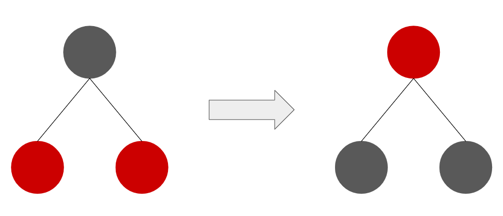

# Red black tree
與AVL tree相同，為了避免BST的worst case，因此它會自己平衡樹的高度，但紅黑樹的樹高和其他平衡樹的定義不同(等一下會提)

紅黑樹會滿足以下條件:
1. 每個node不是黑色就是紅色
2. 整棵tree的root一定是黑色
3. null視為黑色
4. 不能有連續的紅色(紅色的child一定得是黑色)，黑色無此規定
5. 從任意節點到tree leaf的path上會經過相同數量的黑node(紅黑樹樹高，black height)

若違反上面的其中一點，就會進行調整

## Color change
在等一下insert node的過程，若遇到一個node其兩個child皆為紅色，則需要進行此步驟

將此node變為紅色，並將其兩個child變成黑色，如下圖


## Rotation
基本上紅黑樹的rotation也是left rotation和right rotation，和AVL tree相同，請參考下網址

[https://github.com/kow3388/DS_and_Algo/tree/main/DS/AVL_tree](https://github.com/kow3388/DS_and_Algo/tree/main/DS/AVL_tree)

## Insert node
在紅黑樹插入一個node步驟如下
1. 先search node該插入的位置
2. 在search的過程中若遇到某個node兩個child為紅色的話，則進行color change
3. 將x插入正確的位置，顏色為紅色
4. 檢查有無連續的紅色，若有則進行rotation
5. Root一律改為黑色

## Delete node
刪除node和BST的方式不會插到太多，找到其位置並要找一個node去替代其位置，但會需要去紀錄其要刪除點的顏色為後面維護紅黑樹的平衡

講起來容易，其實在implement時相當複雜

## Implement
### C++
```cpp
#include <bits/stdc++.h>

using namespace std;

//color class
enum class Color
{
	Black,
	Red
};

//define node of red black tree
struct Node
{
	int val;
	Color color;
	Node *parent;
	Node *left;
	Node *right;

	Node(): val(0), color(Color::Red), parent(nullptr), left(nullptr), right(nullptr) {}
	Node(int v): val(v), color(Color::Red), parent(nullptr), left(nullptr), right(nullptr) {}
};

class red_black_tree
{
	public:
		Node *root;

		//initial there is no node
		red_black_tree()
		{
			root = nullptr;
		}

		//inorder to check is the red black tree is wrong or not
		void inorder()
		{
			cout << "Inorder: ";
			_inorder(this->root);
			cout << endl;
		}

		//level order to check is the red black tree is wrong or not
		void level_order()
		{
			cout << "Level order: " << endl;
			_levelorder(this->root);
		}

		//insert node
		void insert_node(int val)
		{
			Node *n = new Node(val);
			this->root = _insert_node(this->root, n);
			fix_insert(n);
		}

		void delete_node(int val)
		{
			_delete_node(this->root, val);
		}

	private:
		//find the minimum val node in tree
		Node* minimum(Node *root)
		{
			if(!root || !root->left)
				return root;

			return minimum(root->left);
		}

		void _inorder(Node *root)
		{
			if(!root)
				return;

			_inorder(root->left);
			cout << root->val << " ";
			_inorder(root->right);
		}

		void _levelorder(Node *root)
		{
			if(!root)
			{
				cout << "There is no node!" << endl;
				return;
			}

			queue<Node*> q;
			q.push(root);

			while(!q.empty())
			{
				int s = q.size();
				for(int i = 0; i < s; i++)
				{
					Node *cur = q.front();
					q.pop();

					cout << cur->val;
					if(cur->color == Color::Red)
						cout << "(red) ";
					else
						cout << "(black) ";

					if(cur->left)
						q.push(cur->left);
					if(cur->right)
						q.push(cur->right);
				}
				cout << endl;
			}
		}

		void left_rotation(Node *root)
		{
			Node *r = root->right;
			Node *r_left = r->left;

			r->left = root;
			root->right = r_left;

			if(r_left)
				r_left->parent = root;

			if(!root->parent)
				this->root = r;
			else if(root == root->parent->left)
				root->parent->left = r;
			else
				root->parent->right = r;

			r->parent = root->parent;
			root->parent = r;
		}

		void right_rotation(Node *root)
		{
			Node *l = root->left;
			Node *l_right = l->right;

			l->right = root;
			root->left = l_right;

			if(l_right)
				l_right->parent = root;

			if(!root->parent)
				this->root = l;
			else if(root == root->parent->left)
				root->parent->left = l;
			else
				root->parent->right = l;

			l->parent = root->parent;
			root->parent = l;
		}

		//using BST to find the new node position
		Node* _insert_node(Node *root, Node *n)
		{
			if(!root)
			{
				root = n;
				return root;
			}

			if(root->val > n->val)
			{
				root->left = _insert_node(root->left, n);
				root->left->parent = root;
			}
			else
			{
				root->right = _insert_node(root->right, n);
				root->right->parent = root;
			}

			return root;
		}

		void _delete_node(Node *root, int val)
		{
			//delete node initial be null
			Node *del_node = nullptr;
			Node *inp_node, *fix_node;

			//using BST to find the node need delete
			while(root)
			{
				if(root->val == val)
				{
					del_node = root;
					break;
				}
				else if(root->val > val)
					root = root->left;
				else
					root = root->right;
			}

			//There is no node need delete
			if(!del_node)
			{
				cout << "There isn't node val = " << val << endl;
				return;
			}

			inp_node = del_node;
			Color inp_ori_color = inp_node->color;

			//find inplace node
			if(!del_node->left)
			{
				inp_node = del_node->right;
				fix_node = inp_node;
				Transplant(del_node, inp_node);
			}
			else if(!del_node->right)
			{
				inp_node = del_node->left;
				fix_node = inp_node;
				Transplant(del_node, inp_node);
			}
			else
			{
				inp_node = minimum(del_node->right);

				fix_node = inp_node->right;
				if(inp_node->parent != del_node)
				{
					Transplant(inp_node, fix_node);

					if(fix_node)
						inp_ori_color = fix_node->color;
				}

				Transplant(del_node, inp_node);

				inp_node->left = del_node->left;
				inp_node->left->parent = inp_node;

				inp_node->right = del_node->right;
				inp_node->right->parent = inp_node;

				inp_node->color = del_node->color;
			}

			delete del_node;
			if(inp_ori_color == Color::Red)
				fix_delete(fix_node);
		}

		void color_change(Node *root)
		{
			root->color = Color::Red;
			root->left->color = Color::Black;
			root->right->color = Color::Black;
		}

		//inplace inp_node to del_node's position
		void Transplant(Node *del_node, Node *inp_node)
		{
			//del_node is root
			if(!del_node->parent)
				this->root = inp_node;

			//del_node is left child
			else if(del_node == del_node->parent->left)
				del_node->parent->left = inp_node;

			//del_node is right child
			else
				del_node->parent->right = inp_node;

			//change inplace node's parent
			if(inp_node)
				inp_node->parent = del_node->parent;
		}

		void fix_insert(Node *root)
		{

			Node *uncle;
			//two consecutive red node, need fix
			while(root->parent && root->parent->color == Color::Red)
			{
				//the right child tree of root's grandparent is unbalance
				if(root->parent == root->parent->parent->right)
				{
					uncle = root->parent->parent->left;
					//need color change or not
					if(uncle && uncle->color == Color::Red)
						color_change(root->parent->parent);
					else
					{
						if(root == root->parent->left)
						{
							root = root->parent;
							right_rotation(root);
						}

						root->parent->color = Color::Black;
						root->parent->parent->color = Color::Red;
						left_rotation(root->parent->parent);
					}
				}
				else
				{
					uncle = root->parent->parent->right;
					if(uncle && uncle->color == Color::Red)
						color_change(root->parent->parent);
					else
					{
						if(root == root->parent->right)
						{
							root = root->parent;
							left_rotation(root);
						}
						
						root->parent->color = Color::Black;
						root->parent->parent->color = Color::Red;
						right_rotation(root->parent->parent);
					}
				}

			}

			this->root->color = Color::Black;
		}

		void fix_delete(Node *root)
		{
			if(!root)
				return;

			Node *sibling;
			while(root && root != this->root && root->color == Color::Black)
			{
				if(root == root->parent->left)
				{
					sibling = root->parent->right;
					if(sibling->color == Color::Red)
					{
						sibling->color = Color::Black;
						root->parent->color = Color::Red;
						left_rotation(root->parent);
						sibling = root->parent->right;
					}

					if(sibling->left->color == Color::Black && sibling->right->color == Color::Black)
					{
						sibling->color = Color::Red;
						root = root->parent;
					}
					else
					{
						if(sibling->right->color == Color::Black)
						{
							sibling->left->color = Color::Black;
							sibling->color = Color::Red;
							right_rotation(sibling);
							sibling = root->parent->right;
						}

						sibling->color = root->parent->color;
						root->parent->color = Color::Black;
						sibling->right->color = Color::Black;
						left_rotation(root->parent);
						root = this->root;
					}
				}
				else
				{
					sibling = root->parent->left;
					if(sibling->color == Color::Red)
					{
						sibling->color = Color::Black;
						root->parent->color = Color::Red;
						right_rotation(root->parent);
						sibling = root->parent->left;
					}

					if(sibling->left->color == Color::Black && sibling->right->color == Color::Black)
					{
						sibling->color = Color::Red;
						root = root->parent;
					}
					else
					{
						if(sibling->left->color == Color::Black)
						{
							sibling->right->color = Color::Black;
							sibling->color = Color::Red;
							left_rotation(sibling);
							sibling = root->parent->left;
						}

						sibling->color = root->parent->color;
						root->parent->color = Color::Black;
						sibling->left->color = Color::Black;
						right_rotation(root->parent);
						root = this->root;
					}
				}
			}
			root->color = Color::Black;
		}
};
```
### Python
```python
from enum import Enum
from dataclasses import dataclass, field
from queue import Queue
from typing import Optional

#color class
class Color(Enum):
    Black = 0
    Red = 1

#define node of red black tree
@dataclass
class node:
    val: int = field(default=0)
    color: Color = field(default=Color.Red)
    parent: Optional['node'] = field(default=None)
    left: Optional['node'] = field(default=None)
    right: Optional['node'] = field(default=None)

class red_black_tree:
    #initial there is no node
    def __init__(self):
        self.root = None

    #inorder to check red black tree is wrong or not
    def inorder(self) -> None:
        print('Inorder:')
        self._inorder(self.root)
        print()

    def _inorder(self, root: node) -> None:
        if root == None:
            return

        self._inorder(root.left)
        print(root.val, end=' ')
        self._inorder(root.right)

    #level order to check red black tree is wrong or not
    def levelorder(self) -> None:
        print('Level order:')
        self._levelorder(self.root)

    def _levelorder(self, root: node) -> None:
        if root == None:
            print('There is no node !', end='')
            return

        q = Queue()
        q.put(root)

        while q.qsize() != 0:
            s = q.qsize()

            for i in range(s):
                cur = q.get()

                print('{}({})'.format(cur.val, cur.color.name), end=' ')

                if cur.left != None:
                    q.put(cur.left)

                if cur.right != None:
                    q.put(cur.right)

            print()

    def _left_rotation(self, root: node) -> None:
        r = root.right
        r_left = r.left

        r.left = root
        root.right = r_left

        if r_left != None:
            r_left.parent = root

        if root.parent == None:
            self.root = r
        elif root == root.parent.left:
            root.parent.left = r
        else:
            root.parent.right = r

        r.parent = root.parent
        root.parent = r

    def _right_rotation(self, root: node) -> None:
        l = root.left
        l_right = l.right

        l.right = root
        root.left = l_right

        if l_right != None:
            l_right.parent = root

        if root.parent == None:
            self.root = l
        elif root == root.parent.left:
            root.parent.left = l
        else:
            root.parent.right = r

        l.parent = root.parent
        root.parent = l

    #insert node
    def insert_node(self, v: int) -> None:
        n = node(val=v)
        self.root = self._insert_node(self.root, n)
        self._fix_insert(n)

    #using BST to find the new node position
    def _insert_node(self, root: node, n: node) -> node:
        if root == None:
            root = n
            return root

        if root.val > n.val:
            root.left = self._insert_node(root.left, n)
            root.left.parent = root
        else:
            root.right = self._insert_node(root.right, n)
            root.right.parent = root

        return root

    def _fix_insert(self, root: node) -> node:
        #two consecutive red node, need fix
        while root.parent != None and root.parent.color == Color.Red:
            #the right child tree of root's grandparent is unbalance
            if root.parent == root.parent.parent.right:
                uncle = root.parent.parent.left

                #need color change or not
                if uncle != None and uncle.color == Color.Red:
                    self._color_change(root.parent.parent)
                else:
                    if root == root.parent.left:
                        root = root.parent
                        self._right_rotation(root)

                    root.parent.color = Color.Black
                    root.parent.parent.color = Color.Red

                    self._left_rotation(root.parent.parent)
            #ther left child tree of root's grandparent is unbalance
            else:
                uncle = root.parent.parent.right

                #need color change or not
                if uncle != None and uncle.color == Color.Red:
                    self._color_change(root.parent.parent)
                else:
                    if root == root.parent.right:
                        root = root.parent
                        self._left_rotation(root)

                    root.parent.color = Color.Black
                    root.parent.parent = Color.Red

                    self._right_rotation(root.parent.parent)

        self.root.color = Color.Black

    def _color_change(self, root: node) -> None:
        root.color = Color.Red
        root.left.color = Color.Black
        root.right.color = Color.Black

    #delete node
    def delete_node(self, val: int) -> None:
        self._delete_node(self.root, val)

    def _delete_node(self, root: node, val: int) -> None:
        #delete node initial be None
        del_node = None

        #use BST to find the node need delete
        while root is not None:
            if root.val == val:
                del_node = root
                break

            elif root.val > val:
                root = root.left

            else:
                root = root.right

        if del_node is None:
            print('There is no node val = {}'.format(val))
            return

        inp_node = del_node
        inp_ori_color = inp_node.color

        #find inplace node
        if del_node.left is None:
            inp_node = del_node.right
            fix_node = inp_node
            self._Transplant(del_node, inp_node)

        elif del_node.right is None:
            inp_node = del_node.left
            fix_node = inp_node
            self._Transplant(del_node, inp_node)

        else:
            inp_node = self._minimum(del_node.right)
            fix_node = inp_node.right

            if inp_node.parent != del_node:
                self._Transplant(inp_node, fix_node)

                if fix_node is not None:
                    inp_ori_color = fix_node.color

            self._Transplant(del_node, inp_node)

            inp_node.left = del_node.left
            inp_node.left.parent = inp_node

            inp_node.right = del_node.right
            inp_node.right.parent = inp_node

            inp_node.color = del_node.color

        del del_node
        if inp_ori_color == Color.Red:
            self._fix_delete(fix_node)

    #inplace the inp_node to the del_node's position
    def _Transplant(self, del_node: node, inp_node: node) -> None:
        #delete node is root
        if del_node.parent is None:
            self.root = inp_node

        #delete node is left child
        elif del_node == del_node.parent.left:
            del_node.parent.left = inp_node

        #delete node is right child
        else:
            del_node.parent.right = inp_node

        #change inplace node's parent
        if inp_node is not None:
            inp_node.parent = del_node.parent

    #return the minimum val node of tree
    def _minimum(self, root: node) -> node:
        if root is None or root.left is None:
            return root

        return self._minimum(root.left)

    def _fix_delete(self, root: node) -> None:
        if root is None:
            return

        while root is not None and root != self.root and root.color == Color.Black:
            if root == root.parent.left:
                sibling = root.parent.right
                
                if sibling.color == Color.Red:
                    sibling.color = Color.Black
                    root.parent.color = Color.Red
                    self._left_rotation(root.parent)
                    sibling = root.parent.right

                if sibling.left.color == Color.Black and sibling.right.color == Color.Black:
                    sibling.color = Color.Red
                    root = root.parent

                else:
                    if sibling.right.color == Color.Black:
                        sibling.left.color = Color.Black
                        sibling.color = color.Red
                        self._right_rotation(sibling)
                        sibling = root.parent.right

                    sibling.color = root.parent.color
                    root.parent.color = Color.Black
                    sibling.right.color = Color.Black
                    self._left_rotation(root.parent)
                    root = self.root
            else:
                sibling = root.parent.left
                
                if sibling.color == Color.Red:
                    sibling.color = Color.Black
                    root.parent.color = Color.Red
                    self._right_rotation(root.parent)
                    sibling = root.parent.left

                if sibling.left.color == Color.Black and sibling.right.color == Color.Black:
                    sibling.color = Color.Red
                    root = root.parent

                else:
                    if sibling.left.color == Color.Black:
                        sibling.right.color = Color.Black
                        sibling.color = color.Red
                        self._left_rotation(sibling)
                        sibling = root.parent.left

                    sibling.color = root.parent.color
                    root.parent.color = Color.Black
                    sibling.left.color = Color.Black
                    self._right_rotation(root.parent)
                    root = self.root

            root.color = Color.Black
```

###### `tree`
