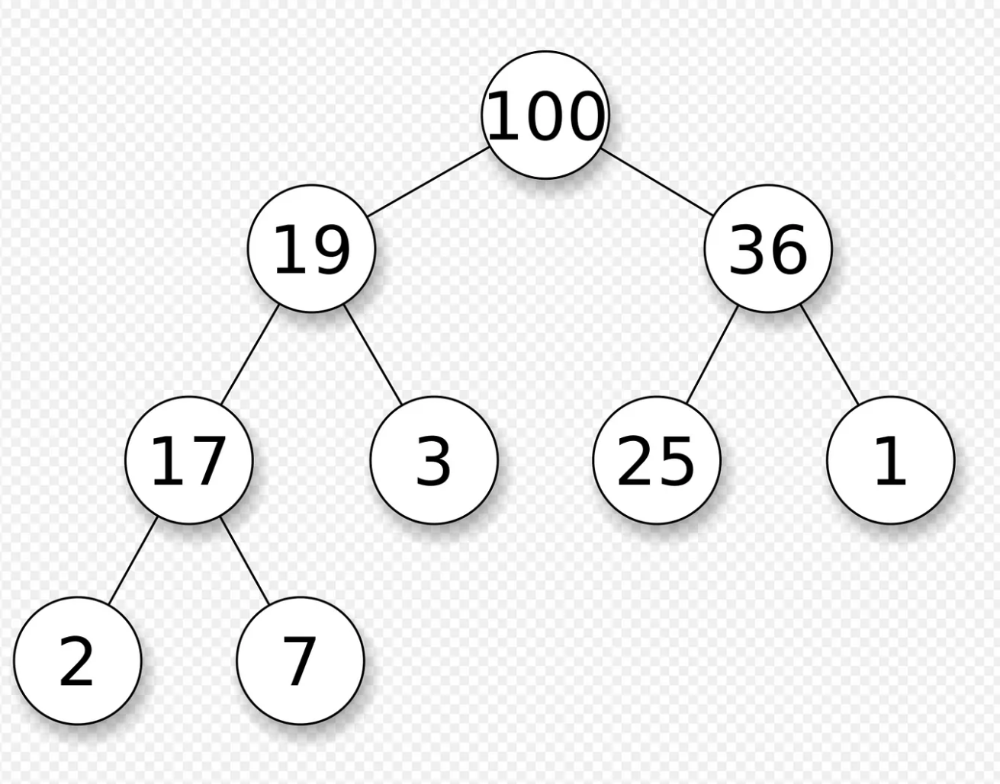

# Heap
Binary heap有以下特色：

- 每個node最多有2個child
- 一定要按照完全樹的順序放入
- 如果是max heap的話parent值一定比2個child值大，min heap則相反
- 若root index = 1, parent index = i，則child index分別為2\*i和2\*i+1
- 若root index = 0, parent index = i，則child index分別為2\*i+1和2\*i+2
- 總node數為n，樹高為logn
- insert和pop node皆為O(logn)


>https://en.wikipedia.org/wiki/Heap_(data_structure)#

Heap有一個特別的操作叫做***heapify***，是將一個無序的數列轉換為符合heap的數列，理論上時間是O(logn)，但其實可以優化到O(n)，可參考下引文
>https://tmt514.github.io/algorithm-analysis/sorting/heapsort.html

Heap sort就是將heap的elements一個一個pop出來，所以worst case為O(nlogn)

## Implement
### C++
```cpp
#include <bits/stdc++.h>

using namespace std;

class heap
{
	public:
		vector<int> h;
		heap(vector<int> arr)
		{
			heapify(arr);
		}

		void heapify(vector<int> arr)
		{
			for(int i = 0; i < arr.size(); i++)
			{
				int new_idx = i;
				int parent_idx = (i+1)/2 - 1;
				h.emplace_back(arr[i]);
				while(parent_idx >= 0)
				{
					if(h[new_idx] > h[parent_idx])
					{
						swap(h[new_idx], h[parent_idx]);
						new_idx = parent_idx;
						parent_idx = (new_idx+1)/2 - 1;
					}
					else
						break;
				}
			}
		}

		void push(int v)
		{
			h.emplace_back(v);
			int new_idx = h.size() - 1;
			int parent_idx = (new_idx+1)/2 - 1;

			while(parent_idx >= 0)
			{
				if(h[new_idx] > h[parent_idx])
				{
					swap(h[new_idx], h[parent_idx]);
					new_idx = parent_idx;
					parent_idx = (new_idx+1)/2 - 1;
				}
				else
					break;
			}

			cout << v << " has been inserted in heap!" << endl;
		}

		int pop()
		{
			if(h.size() == 0)
			{
				cout << "There is no element in heap!" << endl;
				return INT_MIN;
			}

			swap(h.front(), h.back());
			int v = h.back();
			h.pop_back();

			int i = 0;
			int idx = -1;

			while(i < h.size())
			{
				int child_idx1 = 2*i + 1;
				int child_idx2 = 2*i + 2;

				if(child_idx1 >= h.size())
					break;
				else if(child_idx2 >= h.size())
					idx = child_idx1;
				else
					idx = (h[child_idx1] > h[child_idx2])?child_idx1:child_idx2;

				if(h[i] < h[idx])
				{
					swap(h[i], h[idx]);
					i = idx;
				}
				else
					break;
			}

			return v;
		}

		void heap_sort()
		{
			while(h.size() != 0)
			{
				int tmp = this->pop();
				cout << tmp << " ";
			}

			cout << endl;
			cout << "Heap has been empty!" << endl;
		}

};
```

### Python
```python
class heap:
    def __init__(self, arr):
        self.h = self.heapify(arr)

    def heapify(self, arr):
        new_arr = []

        for i in range(len(arr)):
            new_idx = i
            parent_idx = (i+1)//2 - 1
            new_arr.append(arr[i])

            while parent_idx >= 0:
                if new_arr[new_idx] > new_arr[parent_idx]:
                    new_arr[new_idx], new_arr[parent_idx] = new_arr[parent_idx], new_arr[new_idx]
                    new_idx = parent_idx
                    parent_idx = (new_idx+1)//2 - 1
                else:
                    break

        return new_arr

    def push(self, val) -> None:
        self.h.append(val)
        new_idx = len(self.h) - 1
        parent_idx = (new_idx+1)//2 - 1

        while parent_idx >= 0:
            if self.h[new_idx] > self.h[parent_idx]:
                self.h[new_idx], self.h[parent_idx] = self.h[parent_idx], self.h[new_idx]
                new_idx = parent_idx
                parent_idx = (new_idx+1)//2 - 1
            else:
                break

        print("{} has been inserted in heap!".format(val))

    def pop(self):
        if len(self.h) == 0:
            print("There is no element in heap!")
        else:
            self.h[0], self.h[-1] = self.h[-1], self.h[0]

            val = self.h[-1]
            self.h.pop()

            i, idx = 0, -1
            while i < len(self.h):
                child_idx1, child_idx2 = 2*i+1, 2*i+2

                if child_idx1 >= len(self.h):
                    break
                elif child_idx2 >= len(self.h):
                    idx = child_idx1
                else:
                    idx = child_idx1 if self.h[child_idx1] > self.h[child_idx2] else child_idx2

                if self.h[i] < self.h[idx]:
                    self.h[i], self.h[idx] = self.h[idx], self.h[i]
                    i = idx
                else:
                    break

        return val

    def heap_sort(self):
        res = []
        while len(self.h) != 0:
            res.append(self.pop())

        print(res)
```

###### `heap`
